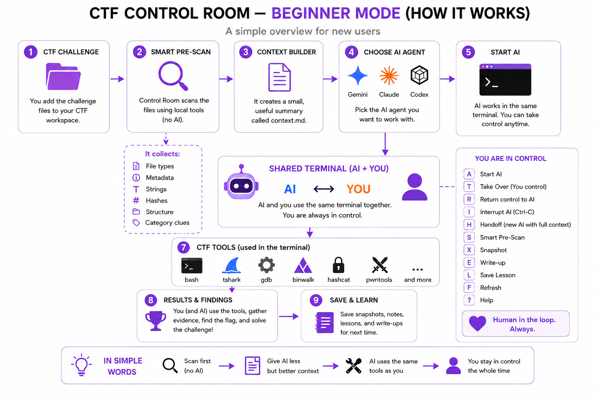
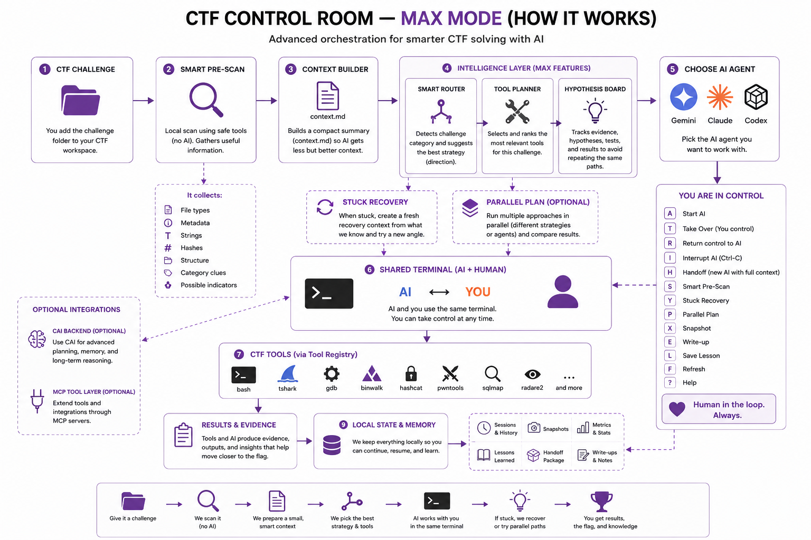

# 💜 CTF Control Room

**A local workspace where humans and AI work together during authorized CTF challenges.**

### What is a CTF?

**CTF (Capture The Flag)** is a cybersecurity competition where players solve technical challenges to find hidden **flags**.

Common categories include:

`Web` • `Crypto` • `Forensics` • `Pwn` • `Reverse` • `Network` • `OSINT` • `Mobile` • `Malware`

---

# Purpose

**CTF Control Room organizes the challenge, AI agents, and CTF tools in one place.**

It first scans the challenge locally, creates useful `context.md`, then lets you work with **Gemini, Claude Code, or Codex** in the same terminal.

> **Scan first → better context → AI + human → shared tools → stay in control**

---
# Advantages

| ⚡ Smart Pre-Scan | 🧠 Better AI Context |
|---|---|
| Checks challenge files **before using AI**. | Creates a small `context.md` with useful information. |

| 👩‍💻 Human in Control | 🤖 Multiple AI Agents |
|---|---|
| **Start, interrupt, take over, or return control to AI** anytime. | Use **Gemini, Claude Code, Codex CLI**, or another supported agent. |

| 🧰 CTF Toolbox | 🔎 Smart Tool Selection |
|---|---|
| Installs optional tool packs and discovers tools already on your machine. | Recommends tools that match the current challenge. |

| 💾 Organized Workflow | 🚀 Max Mode |
|---|---|
| Saves **sessions, snapshots, commands, notes, findings, and write-ups**. | Adds **Smart Router, Tool Planner, Hypothesis Board, Stuck Recovery, and Parallel Plan**. |

| 🏠 Local-First | 🛠️ Shared Tools |
|---|---|
| Most challenge data and results stay on your machine. | Human and AI can use the same tools such as `gdb`, `tshark`, `binwalk`, `hashcat`, `pwntools`, and more. |
## 🚀 Start setup Here

Choose the setup that matches how you want to use Control Room:

| Mode | Best for | Setup |
|---|---|---|
| **Beginner / Standard** | New users who want the normal CTF Control Room workflow | `./setup.sh` |
| **Max Mode** | Users who want Router, Tool Planner, Hypothesis Board, Stuck Recovery, Parallel Plan, and advanced switches | `./setup-max.sh` |
| **Manual / Custom** | Users who want to configure individual packages and features themselves | See [`ADVANCED.md`](ADVANCED.md) |


## 📦 Installation & Setup

These are the exact commands a new GitHub user can follow.

### 1. Clone the repository

```bash
git clone https://github.com/Nourah-Alotaibi/ctf-control-room.git
cd ctf-control-room
```

### 2. Beginner / Standard setup

Recommended for new users:

```bash
chmod +x setup.sh
./setup.sh
```

This creates the private Python environment, installs CTF Control Room, prepares the `~/CTF` workspace, offers optional toolbox installation, and runs the setup doctor.

Launch:

```bash
./.venv/bin/ctf-go ~/CTF
```

### 3. Max setup

For the advanced/max configuration:

```bash
chmod +x setup-max.sh
./setup-max.sh
```

This applies the Max power profile and installs additional optional CTF tooling where available.

You can also apply the Max profile manually:

```bash
./.venv/bin/ctf-power profile max
```

Expected Max switches:

```text
smart_router       ON
tool_planner       ON
hypothesis_board   ON
stuck_recovery     ON
parallel_agents    ON
cai_backend        ON
```

> `cai_backend ON` only enables the integration switch. CAI itself must be installed separately if you want to use it.

Launch Max Mode with the same command:

```bash
./.venv/bin/ctf-go ~/CTF
```

### 4. Check your AI agent

AI agents are **not installed automatically**.

Control Room currently looks for supported runnable terminal agents such as Gemini, Claude Code, and Codex.

Check them manually:

```bash
gemini --version
claude --version
codex --version
```

You only need one supported runnable agent.

To check what Control Room itself detects:

```bash
./.venv/bin/python -c "from ctf_control.core.agents import available_agents; print(available_agents())"
```

Example:

```text
['gemini']
```

If no runnable agent is installed, Control Room still works without AI for local challenge management, Smart Pre-Scan, tools, snapshots, notes, and other local features.

### 5. Run the health check

Before a competition:

```bash
./.venv/bin/ctf-doctor
```

This checks the environment and runs a harmless local self-test.

### 6. Normal launch after installation

Whenever you want to open CTF Control Room later:

```bash
cd ~/ctf-control-room
./.venv/bin/ctf-go ~/CTF
```


### Beginner Mode — How It Works

Beginner Mode focuses on the **core workflow only**:

```text
Challenge
   ↓
Smart Pre-Scan (No AI)
   ↓
Compact context.md
   ↓
Choose Gemini / Claude / Codex
   ↓
AI + Human share the terminal
   ↓
Use installed CTF tools
   ↓
Findings / Flag
   ↓
Snapshot / Write-up / Lessons
```

<p align="center">
  
</p>
### 🟣 Beginner Mode

Complete guide covering setup, Smart Pre-Scan, AI agents, shared terminal, CTF tools, controls, examples, and troubleshooting.

[⬇️ Download Beginner Mode Complete Guide](docs/guides/CTF_Control_Room_Beginner_Mode_Complete_Guide.docx?raw=1)

**In simple words:** scan first, give the AI less but better context, let the AI use the same tools as you, and keep the human in control.

### Max Mode — How It Works

Max Mode includes the same core workflow, then adds the advanced orchestration layer:

```text
Challenge
   ↓
Smart Pre-Scan
   ↓
Compact Context
   ↓
Smart Router
   ↓
Tool Planner
   ↓
Hypothesis Board
   ↓
AI Agent ↔ Human
   ↓
Shared Terminal
   ↓
CTF Tools
   ↓
Evidence / Results
   ↓
Continue ── or ── Stuck Recovery / Parallel Plan
```

<p align="center">
  
</p>

> **Max Mode is not “fully autonomous mode.”** Human takeover remains available. Some Max features can also increase AI/token usage.

---

## 🖥️ Interface Tour

The application has three main screens. The screenshots below show what a new user will see.

**Image files used by this README:**

```text
docs/images/beginner.png
docs/images/max.png
docs/images/welcome page.png
docs/images/ctf room.webp
docs/images/help room.webp
```

### 1. Welcome Screen

This is the first screen new users see. It introduces CTF Control Room, explains CTF briefly, and gives access to the dashboard and Help page.


### 2. Control Room Dashboard

This is the main working screen. It contains challenge selection, AI-agent selection, Smart Pre-Scan status, the shared terminal, activity information, and keyboard controls.


### 3. Help & Guide

This page explains the controls and advanced features without forcing a new user to read the entire README first.


---

## How It Works

```text
Challenge
   ↓
Smart Pre-Scan
NO AI • max 60 seconds
   ↓
Raw results saved locally
+ compact context.md
   ↓
Optional AI Agent
Claude Code / Codex / Gemini / compatible client
   ↓
Tool Registry
FAST → DEEP → EXPENSIVE
   ↓
Installed CTF tools + local reference repos
   ↓
Shared terminal
AI ↔ Human Takeover
   ↓
Handoff • Snapshot • Write-up
```

The Smart Pre-Scan gives the AI useful context **before** it starts reasoning. Full tool output stays on disk; only compact useful findings are placed into AI context.

---

## Features

### ⚡ Smart Pre-Scan — No AI

Press `S` to run quick deterministic inspection before involving an AI.

It can use lightweight tools appropriate to the challenge and stops when:

- enough useful findings have been collected,
- the 60-second limit is reached,
- the next useful tool is heavy,
- the work would repeat an existing result,
- or a human decision is needed.

If the scan finds nothing useful, that is recorded and the AI can choose a deeper approach.

###  Bring your own AI

Use whichever supported terminal agent you already have installed.
The agent must also be runnable in the same WSL shell; Control Room verifies this with the client's `--version` command before listing it.

Examples:

- Claude Code
- Codex CLI
- Gemini CLI
- compatible clients using local Ollama models

A user with **only Claude Code** can still use Control Room. AI agents are never installed automatically.

### 🧰 Optional CTF Toolbox

Control Room itself stays lightweight. CTF tools are installed only if the user chooses them.

Start the friendly installer:

```bash
ctf-tools wizard
```

Available packs include:

| Pack | Examples |
|---|---|
| `core` | file inspection, binutils, ripgrep, jq, curl, xxd, ExifTool, archives |
| `forensics` | binwalk, foremost, tshark, pngcheck, steghide |
| `network` | tshark, tcpdump, nmap, Scapy |
| `pwn` | GDB, pwntools, ROPgadget, ropper, pwndbg |
| `reverse` | GDB, radare2, binutils, r2pipe |
| `crypto` | John, hashcat, PyCryptodome, Z3, xortool, RsaCtfTool |
| `web` | sqlmap, nikto, whatweb, PayloadsAllTheThings, HackTricks, jwt_tool |
| `mobile` | adb, apktool, Frida tools |
| `malware` | YARA, pefile |
| `osint` | whois, DNS utilities, Sherlock |

Install packs later at any time:

```bash
ctf-tools install core forensics network
```

Check what is available:

```bash
ctf-tools status
```

GitHub tools/reference repositories are kept under:

```text
~/CTF/tools/
```

### 🔎 Automatic Tool Discovery

Different users have different tools installed.

Control Room checks:

```text
WSL / PATH
    ↓
Which command-line tools exist?

~/CTF/tools/
    ↓
Which optional GitHub repos exist?

Tool Registry
    ↓
Show the AI tools that are actually available
```

This means the agent does not need to assume that every user has the same environment.

### 📚 Local GitHub Reference Search

Reference repositories such as **HackTricks** and **PayloadsAllTheThings** can be cloned by the optional toolbox.

The AI can search those local repositories while solving a challenge. The structured search helper returns only relevant matches instead of dumping entire repositories into the model context.

With MCP, the helper is exposed as:

```text
search_ctf_references(...)
```

### 🔌 Optional MCP Tool Layer

For compatible AI clients, MCP gives the agent a structured interface to Control Room.

Install the optional MCP dependency:

```bash
pip install -e '.[mcp]'
```

For the current challenge:

```bash
export CTF_CONTROL_CHALLENGE="$PWD"
ctf-mcp
```

The MCP layer exposes:

```text
list_ctf_tools
recommend_ctf_tools
read_prepared_context
search_ctf_references
run_ctf_tool
```

This lets an agent ask what tools are available, request relevant tools for a category, read the compact pre-scan context, search local references, and execute registered installed tools.

Tools marked `EXPENSIVE` are blocked through MCP by default.

### 👩‍💻 Human Takeover

The AI and human work with the same challenge environment.

```text
T → Take Over
```

You take control and type commands yourself.

```text
R → Return to AI
```

The AI continues from the current state instead of starting over.

### ⚡ Result Cache

If the same command is requested against unchanged relevant files, Control Room can reuse the existing saved result instead of repeating the analysis.

This reduces duplicate tool work during a competition.

### 📸 Challenge Snapshots

Press:

```text
X
```

to save the current challenge state, including available context, scripts, metrics, command history, notes, and findings.

Useful before an agent handoff or a risky experiment.

### 🧩 Lightweight Session Isolation

No containers are required.

Each challenge keeps its own files, cache, logs, and agent session state under its own folder:

```text
challenge/
└── .ctf/
    ├── sessions/
    │   ├── claude-1/
    │   └── codex-1/
    ├── cache/
    ├── raw/
    └── snapshots/
```

This keeps parallel work separated without adding extra setup.

Examples:

```text
Challenge A → Claude session
Challenge B → Claude session
```

or:

```text
Challenge A → Claude
Challenge B → Codex
```

The agents can run at the same time because each challenge has its own working state.

### 🩺 Setup Doctor

Before a competition, run:

```bash
ctf-doctor
```

It checks the local environment, reports detected tools/AI clients, and creates a harmless temporary sample challenge to verify:

```text
Challenge discovery
      ↓
Smart Pre-Scan
      ↓
context.md
      ↓
Tool Registry
```

The self-test does not contact an AI or remote target.

---

## Quick Start

### Beginner / Standard — recommended for new users

Run:

```bash
./setup.sh
```

The setup script:

- checks Python,
- creates the private `.venv`,
- installs Control Room,
- creates `~/CTF/` category folders,
- lets you choose optional toolbox packages,
- runs `ctf-doctor`.

Then launch:

```bash
./.venv/bin/ctf-go ~/CTF
```

For a beginner walkthrough, see [`BEGINNER.md`](BEGINNER.md).

### Max Mode

If you want the advanced/max configuration:

```bash
./setup-max.sh
```

This installs the remaining optional packs where available, applies the Max power profile, and runs the final health check.

Max Mode enables advanced switches such as:

```text
Smart Router
Tool Planner
Hypothesis Board
Stuck Recovery
Parallel Agents / Parallel Plan
CAI backend switch
```

> External AI agents and CAI are still **not installed automatically**.

### Manual / Custom Setup

If you prefer to configure everything yourself:

```bash
python3 -m venv .venv
source .venv/bin/activate
pip install -e .
ctf-tools install core
ctf-go ~/CTF
```

Optional MCP and custom configuration are documented in [`ADVANCED.md`](ADVANCED.md).

### Important

**The same installed toolbox is available to Control Room and to the AI agent.**

Control Room discovers tools from the WSL/Linux `PATH` and from `~/CTF/tools/`. A terminal AI working in that environment can use those same installed tools. With MCP, compatible agents can also access them through Control Room's structured tool interface.

AI agents themselves are never installed automatically.

---

## AI Power Features

Control Room separates low-cost orchestration from features that may increase AI usage.

### On by default — no extra AI call required

**Smart Agent Router**

Uses the known CTF category and local pre-scan clues to prepare the most relevant specialist role, such as Reverse Engineering, Pwn, Crypto, Forensics, or Web.

**Smart Tool Planner**

Ranks a short list of installed tools that make sense for the current category and evidence. This avoids showing the AI an unnecessarily huge toolbox.

**Hypothesis Board**

Stores current evidence, attempted ideas, and next steps in the challenge `.ctf/` state. It helps handoffs and reduces repeated investigation.

These features are deterministic/local and are intended to reduce wasted time and context.

### Optional — may use more AI tokens

**Stuck Recovery**

Enable:

```bash
ctf-power enable stuck_recovery
```

Press `Y` when you want a fresh recovery pass. Control Room prepares a compact summary of the failed approach and asks for genuinely different next approaches.

**Parallel Agents**

Enable:

```bash
ctf-power enable parallel_agents
```

Press `P` to prepare independent investigation branches for a difficult or high-value challenge.

Parallel agents can reduce wall-clock time but may multiply model/token usage, so the feature is off by default.

**CAI Advanced Backend**

CAI integration is optional. Control Room detects it if the user installs it separately. It is never installed automatically because it is an advanced external agent framework and may generate additional model usage.

### 🟣 Max Mode

Complete guide covering Smart Router, Tool Planner, Hypothesis Board, Stuck Recovery, Parallel Plan, CAI, MCP, advanced tooling, and more.

[⬇️ Download Max Mode Complete Guide](docs/guides/CTF_Control_Room_Max_Mode_Complete_Guide.docx?raw=1)

### Simple power profiles

```bash
ctf-power profile standard
```

Router + Tool Planner + Hypothesis Board.

```bash
ctf-power profile advanced
```

Adds Stuck Recovery.

```bash
ctf-power profile max
```

Enables all advanced switches, including Parallel Agents and CAI mode.

You can always turn expensive features off again.


## TUI Navigation

The current build uses one consistent terminal design:

- dark charcoal/black background,
- purple borders and action accents,
- white primary text,
- category/status accent colors,
- monospaced terminal layout.

### Welcome Screen

Launch opens the Welcome screen first.

```text
Enter → Open Control Room
?     → Help & Guide
Q     → Quit
```

Press `W` from the dashboard or Help page to return to Welcome.

> See the **Welcome Screen** screenshot in the Interface Tour above.

### Control Room Dashboard

The dashboard is the main workspace. It keeps the challenge list, current challenge, AI-agent selector, Smart Pre-Scan status, shared terminal, activity information, and shortcuts in one place.

> See the **Control Room Dashboard** screenshot in the Interface Tour above.

### Help & Guide

Press `?` from the dashboard to open the full Help page.

It explains:

- Quick Start,
- Take Over / Return to AI,
- Smart Pre-Scan,
- Handoff and Snapshot,
- Hypothesis Board,
- Stuck Recovery,
- Parallel Plan,
- Tool Discovery and Tool Planner,
- toolbox and local reference repositories,
- MCP,
- AI power profiles,
- system shortcuts.

Press `ESC` to return, or `W` to go to Welcome.

> See the **Help & Guide** screenshot in the Interface Tour above.

## Controls

| Key | Action | Meaning |
|---|---|---|
| `S` | Smart Pre-Scan | Fast automatic inspection with no AI |
| `A` | Start AI | Start the selected AI agent that you installed |
| `T` | Take Over | Give the human control of the working terminal |
| `R` | Return to AI | Return terminal control to the AI |
| `I` | Interrupt | Send Ctrl-C to the current process |
| `H` | Handoff | Prepare current progress for another agent |
| `X` | Snapshot | Save the current challenge state |
| `Y` | Stuck Recovery | Prepare an optional fresh-reasoning recovery when enabled |
| `P` | Parallel Plan | Prepare optional parallel investigation branches when enabled |
| `E` | Write-up | Prepare a local write-up without an AI call |
| `L` | Save Lesson | Save a reusable CTF technique |
| `F` | Refresh | Refresh the dashboard/challenge list |
| `?` | Help | Show Quick Help at any time |
| `Q` | Quit | Exit while keeping saved work |

---

## Challenge Data

Control Room keeps its internal state under the challenge's `.ctf/` directory.

Typical generated files include:

```text
challenge/
├── challenge files...
└── .ctf/
    ├── context.md
    ├── tool_registry.md
    ├── commands.jsonl
    ├── metrics.json
    ├── raw/
    ├── cache/
    ├── sessions/
    └── snapshots/
```

Full raw results remain local while compact context is prepared for the AI.

---

## Safety and Competition Rules

CTF Control Room is intended for **authorized CTF competitions, labs, and systems you have permission to test**.

- Follow the competition's rules on AI and automation.
- Network/web offensive tools are not part of the automatic Smart Pre-Scan.
- Heavy/expensive registered tools are not automatically escalated.
- Human takeover and interruption remain available during agent operation.
- Do not use the project against systems you do not have authorization to test.

---

## Current Version

**Current build**

Highlights:

- purple terminal dashboard and welcome screen
- adaptive no-AI Smart Pre-Scan
- optional modular CTF toolbox
- automatic tool discovery
- optional MCP integration
- local GitHub reference search
- shared human/AI workflow
- duplicate-work protection and result cache
- challenge snapshots
- lightweight per-challenge/session isolation

- `ctf-doctor` setup self-test
- local metrics and write-up support

---

## Author

**Nourah Alotaibi**

Built as a practical experiment in human-AI collaboration for CTF workflows.


## Install Reliability

The installer is designed to **skip unavailable optional tools instead of failing the whole setup**.

For example, if one package is unavailable in your WSL repository:

```text
radare2 → unavailable
```

Control Room skips that package and continues installing the rest of the pack.

GitHub tools such as `pwndbg`, `RsaCtfTool`, and `jwt_tool` also get a best-effort local setup step after cloning.

Before setup, you can run:

```bash
ctf-install-check
```

After setup:

```bash
ctf-doctor
```

For the advanced/max path:

```bash
./setup-max.sh
```

This now actually installs the remaining optional packs, applies the max power profile, and runs the final health check.

## Fast Setup Choices

Normal setup:

```bash
./setup.sh
```

Advanced/max-tool setup helper:

```bash
./setup-max.sh
```

During setup you choose:

```text
Toolbox:
1. Recommended
2. Minimal
3. Choose Manually
4. Skip

AI power:
1. Standard
2. Advanced
3. Max
```

The high-token AI features remain optional even after installation.


## Install Checks

The toolbox now distinguishes **package names** from the commands they provide
(for example `binutils → readelf`, `dnsutils → dig`, and `p7zip-full → 7z`),
so `ctf-tools status` is more accurate.

For the maximum setup, one command is enough:

```bash
./setup-max.sh
```

It automatically chooses the Recommended toolbox, Max power profile, installs
the remaining optional packs, and runs the final checks.

An internet connection is required during first setup for Python packages and
GitHub repository clones.

## UI Compatibility

The agent selector now opens correctly even when no AI agent is installed.
This fixes `EmptySelectError` with newer Textual releases.
